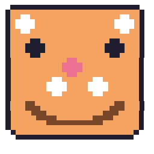

# ASCII Pets

Десктопные питомцы из ASCII-арта, которые живут на панели задач Windows. Никаких спрайтов и картинок — только текст, моноширинный шрифт и немного магии Electron.

Питомец живёт в прозрачной полноширинной полосе над таскбаром: гуляет (или прыгает), спит, голодает, просит еды, радуется поглаживаниям и иногда издаёт звуки.



## Питомцы

| Питомец | Характер | Передвижение |
|---|---|---|
| Кот | `cat` (по умолчанию) | ходит |
| Пёс | `dog` | ходит |
| Лягушка | `frog` | прыгает по параболе, иногда квакает |

Можно держать до **2 питомцев** одновременно (настройка «Второй питомец» в меню).

Весь арт лежит в `src/renderer/ascii.ts` (`SKINS`). Каждый скин обязан иметь: `walk × 4` + пары `happy / hungry / sleep / jump` + `blink / eat`, все кадры скина — одной (нативной) высоты без пустых строк (в `ascii1`: кот 4, пёс 6, лягушка 4; в `ascii3`: 6/8/5; проверяется тестом `test/skins.test.mjs`).

Спрайты ниже — стиль `ascii1`, первые кадры ходьбы (сверены с `src/renderer/ascii.ts`). Стиль рисовки переключается в меню: `ASCII 1 — классика`, `ASCII 2 — блоки`, `ASCII 3 — тамагочи` (1-битные пиксельные блобы).

Кот:

```text
  \    /\
   )  ( o)
  (  /  )
~ \(__)|_|
```

Пёс:

```text
  /^ ^\
 / 0 0 \
 V\ Y /V
  / - \
 /  |  \
|_| | |_|
```

Лягушка:

```text
     ()-()
   .-(___)-.
    _<   >_
     \/   \/
```

## Возможности

- **Нужды:** голод / настроение / энергия (`src/shared/pet-stats.ts`). Сохраняются в `localStorage`, при офлайне — догоняющий пересчёт до 8 часов.
- **Взаимодействия:**
  - одинарный клик — погладить,
  - двойной клик — покормить,
  - таскание мышью,
  - правый клик — контекстное меню (оно же — меню трея).
  - кучки: иногда остаются после еды — клик по кучке убирает её, кнопка 💩 в окне статуса убирает все сразу (серая вонь анимирована):

```text
  _
 (_)
(___)
```
- **Трей:** единственное присутствие в системе (окно-полоса скрыто из таскбара). Тултип показывает сытость/настроение/энергию, уведомления о голоде — клик по тосту кормит всех.
- **Окно статуса:** плавающая карточка с полосками сытости/настроения/энергии и кнопками ♥ / 🍖 / 💩 / ✕ (погладить всех, покормить всех, убрать все кучки, скрыть).
- **Авто-инверсия:** раз в секунду фон под каждым символом семплируется и цвет инвертируется по ячейкам, чтобы питомец читался на любых обоях.
- **Звук:** синтез через WebAudio (мур / гав / ква), отключается в меню.
- **Размер питомца:** 85% / 100% / 130% / 160%.
- **Пауза, поверх всех окон, автозапуск с Windows, автообновление** (через `electron-updater`, только для NSIS-сборки).

## Требования

- Node.js 20+
- Windows (позиционирование заточено под таскбар Windows)
- Python — только для регенерации иконок (`scripts/make-icon.py`)

Первый `npm start` скачивает бинарник Electron, первый `npm run dist` — NSIS-утилиты. Оба могут занять несколько минут, это нормально.

## Быстрый старт

```bash
npm install
npm start      # сборка + запуск
```

Остальные команды:

```bash
npm run dev    # watch-режим (scripts/dev.js, перезапускает Electron только при изменениях main/preload/shared)
npm test       # сборка main + node --test для test/*.test.mjs
npm run build  # tsc (main) + tsc --noEmit (check всего src/) + esbuild (renderer)
npm run dist   # сборка + electron-builder (NSIS + portable в release/)
```

Проверка типов рендера отдельно:

```bash
npm run check
```

## Где что лежит

```
src/
  main.ts            # окно-полоса, трей, семплер фона, настройки, автообновление
  preload.ts         # единственный мост window.petAPI (contextIsolation, без Node в рендере)
  shared/            # чистая логика без Electron/DOM (покрыта тестами)
    pet-stats.ts     # голод/настроение/энергия
    placement.ts     # stripBounds() — определение края таскбара
    skins.ts         # реестр скинов, normalizePack, MAX_PETS=2
    temperament.ts   # CALM/WILD пресеты, rollGait / jitterTemperament
    color.ts         # invert/median/css, frameCells, per-cell ink
    ipc.ts           # PetSnapshot — контракт main ↔ renderer
    notify.ts        # троттлинг уведомлений о голоде
  renderer/
    renderer.ts      # класс Pet (один элемент на слот), выбор кадров, hopStep()
    ascii.ts         # весь ASCII-арт (SKINS)
    pet-store.ts     # localStorage нужд
    sound.ts         # WebAudio-синтез
    index.html
test/                # node --test, импортируют compiled dist/shared/*.js
scripts/
  dev.js             # dev-вотчер на stdlib
  make-icon.py       # регенерация assets/icon.{png,ico}, icon-16.png
assets/              # сгенерированные иконки, не править вручную
```

## Настройки и данные

- Настройки приложения: `%APPDATA%/ASCII Pets/settings.json` (`pack`, `colorMode`, `onTop`, `openAtLogin`, `muted`, `petScale`, `notifyHungry`). При первом запуске мигрируют из старого `ASCII Companion`.
- Нужды питомцев: `localStorage` в рендере (ключи на слот).
- Автозапуск применяется только в упакованном приложении (`app.isPackaged`).

## Контракт окна (не ломать)

- Полоса из `screen.getPrimaryDisplay()` через `stripBounds()` (`PET_H=200`); низ окна впритык к низу workArea (= верхняя кромка таскбара), пол питомцев ровно на ней, все прыжки стартуют от неё.
- `transparent: true, frame: false`, `setAlwaysOnTop(true, "screen-saver")` (именно `screen-saver` — поверх таскбара; `floating` прячется за ним), `skipTaskbar: true`.
- Click-through по умолчанию (`setIgnoreMouseEvents(true, { forward: true })`); кликабельность включается только при наведении на питомца через IPC `set-clickable`. Всю полосу кликабельной делать нельзя — перекроет таскбар.
- В рендере нет Node (`contextIsolation: true, nodeIntegration: false`) — никакого CommonJS `require()` там, иначе окно останется невидимо пустым.

## Тесты

```bash
npm test
```

Тесты: `pet-stats`, `placement`, `skins` (включая бандлинг `ascii.ts` через esbuild и проверку кадров), `temperament`, `color`, `notify`, `social`. Зависимостей у тестов нет.

## Лицензия

MIT — см. [LICENSE](LICENSE).
