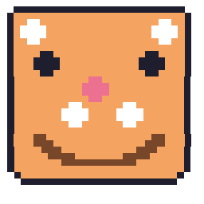

# ASCII Pets

Десктопные питомцы из ASCII-арта, которые живут на панели задач Windows. Никаких спрайтов и картинок — только текст, моноширинный шрифт и немного магии Electron.

Питомец живёт в прозрачной полноширинной полосе над таскбаром: гуляет (или прыгает), спит, голодает, просит еды, радуется поглаживаниям, какает (в том числе на лету), поёт длинные песни, болтает бабблами и встречается с другими питомцами. Птица большую часть времени летает по всему экрану. Очень редко у каждого случаются особые состояния: агрессия кота, вой пса, долгий квак лягушки.



## Что нового (Unreleased)

- **Птица летает**: круиз по всему экрану (взмах-парение, рулевое управление), посадки на пол; сон/еда/социалки — только на земле.
- **Четыре питомца**, сцены на всю стаю, окно статуса тянется под 1–4.
- **Бабблы и чат**: реплики над головой (`*мур*`, `Привет!`, `♪ песня`) + разговоры пар каждые 3–7 минут.
- **Звук**: ползунок громкости, песни длиннее (~5 сек), барабаны парада, вальс танца, урчание кота, +15% общей громкости.
- **Какашки**: спонтанные + падающие с воздуха с гравитацией; новый вид (куча) и тёмно-коричневый цвет.
- **Апдейтер**: один тост с установкой по клику, статус в настройках, перепроверка каждые 6 часов.

## Что нового в 0.1.1

- **Сцена на весь экран**: окно покрывает весь `workArea` (раньше — полоса 200px у таскбара).
- **Ребаланс энергии** (еда +25, выносливость по скинам в социалках и броске) и **тумблер теней** в настройках.
- **Апдейтер**: без крашей при офлайне, portable-версия обновляется вручную (пункт меню помечен).

## Что нового в 0.1.0

- **Три питомца** и сцены встреч: парные + тройные (`huddle`, `parade`), с влиянием на настроение и энергию.
- **Отдельное окно настроек** (питомцы, стиль, размер, монитор, поведение) + кнопка ⚙ в окне статуса.
- **Стиль ASCII 4 — пиксель**: цветной, генерируется скриптом, рисуется бесшовно на канвасе.
- **Звуки всех событий и песни** (2–3 мелодии на пета со своим голосом), новые реакции: бросок, подозвать, отпор, побудка.
- **Кучки ×2**, сон лечит, выносливость по скинам, перф сэмплера, FPS-счётчик, страж always-on-top.

Полная история изменений — в [CHANGELOG.md](CHANGELOG.md).

## Питомцы

| Питомец | Характер | Передвижение |
|---|---|---|
| Кот | `cat` (по умолчанию) | ходит |
| Пёс | `dog` | ходит |
| Лягушка | `frog` | прыгает по параболе, иногда квакает (редко — глубокий 20-секундный квак) |
| Птица | `bird` | летает по всему экрану очередями взмахов с планированиями, садится на пол отдохнуть |

Можно держать до **4 питомцев** одновременно (селекты в окне настроек).

Весь арт лежит в `src/renderer/ascii.ts` (стили `SKIN_STYLES`: `ascii1` — классика, `ascii2` — блоки, `ascii3` — тамагочи, `ascii4` — пиксель из `scripts/pixel-art.py` → `ascii4-generated.ts` + `assets/pixel-*.png`). Каждый скин обязан иметь: `walk × 4` + пары `happy / hungry / sleep / jump` + `blink / eat`, все кадры скина — одной (нативной) высоты без пустых строк (проверяется тестом `test/skins.test.mjs`; у ascii4 ещё и таблицы цветов тех же размеров).

Спрайты ниже — стиль `ascii1`, первые кадры ходьбы (сверены с `src/renderer/ascii.ts`). Стиль рисовки переключается в окне настроек: `ASCII 1 — классика`, `ASCII 2 — блоки`, `ASCII 3 — тамагочи` (1-битные пиксельные блобы), `ASCII 4 — пиксель` (цветной, генерируется скриптом).

Кот:

```text
  \    /\
   )  ( o)
  (  /  )
~ \(__)|_|
```

Пёс:

```text
  /^ ^\
 / 0 0 \
 V\ Y /V
  / - \
 /  |  \
|_| | |_|
```

Лягушка:

```text
     ()-()
   .-(___)-.
    _<   >_
     \/   \/
```

Птица:

```text
   (o o)   
  \( v )// 
   (___)   
   \/ \/   
```

## Возможности

- **Нужды:** голод / настроение / энергия (`src/shared/pet-stats.ts`, выносливость своя у каждого скина, сон восстанавливает). Сохраняются в `localStorage`, при офлайне — догоняющий пересчёт до 8 часов.
- **Взаимодействия:**
  - одинарный клик — погладить (перебор — отпор и −настроение),
  - двойной клик — покормить,
  - двойной клик по пустому — подозвать (поворачиваются),
  - таскание мышью, бросок с размаха — полёт с инерцией,
  - клик по спящему — разбудить,
  - правый клик — контекстное меню (оно же — меню трея).
  - кучки: до 2 на пета после еды + спонтанные (~раз в 10 мин) + падающие с воздуха у летящей птицы — клик по кучке убирает её, кнопка 💩 в окне статуса убирает все сразу (появление/исчезновение с затуханием, серая вонь анимирована):

```text
     _
   _(_)_
__ (___) __
```
- **Трей:** единственное присутствие в системе (окно-полоса скрыто из таскбара). Тултип показывает сытость/настроение/энергию, уведомления о голоде — клик по тосту кормит всех.
- **Окно статуса:** плавающая карточка с полосками сытости/настроения/энергии и кнопками ♥ / 🍖 / 💩 / ⚙ / ✕ (погладить всех, покормить всех, убрать все кучки, настройки, скрыть); высота подгоняется под 1–4 петов; опциональный FPS-счётчик.
- **Окно настроек:** frameless-карточка (питомцы ×4, стиль, размер, монитор, поведение), высота подгоняется под содержимое; открывается из меню и кнопкой ⚙.
- **Встречи петов:** парные и сцены на всю стаю 2–4 с (игра, догонялки, ссоры, обнюхивания, танцы, гонки, обнимашки, парад) с голосами, музыкой (барабаны парада, вальс танца) и влиянием на настроение/энергию.
- **Песни:** редко (раз в ~5 минут) пет поёт одну из своих мелодий (~5 сек) своим голосом, ноты ♪ уплывают вверх, название — в баббле.
- **Бабблы и чат:** реплики над головой (голоса, приветствия, еда, испуг) + разговоры пар каждые 3–7 минут.
- **Особые состояния (очень редко):** агрессия кота, вой пса, глубокий 20-секундный квак лягушки.
- **Авто-инверсия:** фон под каждым символом семплируется и цвет инвертируется по ячейкам, чтобы питомец читался на любых обоях (пропуск статичных кадров, автодеградация интервала на тяжёлых конфигурациях, тишина на паузе).
- **Звук:** синтез через WebAudio (голоса, шаги, прыжки, еда, уборка, социалки — у каждого скина свой тембр), чекбокс «Звук» + ползунок громкости в настройках; сердечки `<3` светятся розовым.
- **Размер питомца:** 85% / 100% / 130% / 160%.
- **Пауза, поверх всех окон** (страж уровня + single-instance), **монитор сцены, автозапуск с Windows, автообновление** (один тост с установкой по клику, статус в настройках, перепроверка каждые 6 часов; только NSIS-сборка, portable обновляется скачиванием нового файла).

## Требования

- Node.js 20+
- Windows (позиционирование заточено под таскбар Windows)
- Python — только для регенерации арта (`scripts/make-icon.py` — иконки, `scripts/pixel-art.py` — стиль ASCII 4 + `assets/pixel-*.png`)

Первый `npm start` скачивает бинарник Electron, первый `npm run dist` — NSIS-утилиты. Оба могут занять несколько минут, это нормально.

## Быстрый старт

```bash
npm install
npm start      # сборка + запуск
```

Остальные команды:

```bash
npm run dev    # watch-режим (scripts/dev.js, перезапускает Electron только при изменениях main/preload/shared)
npm run start:fast  # сборка без typecheck + запуск (быстрые итерации)
npm test       # сборка main + node --test для test/*.test.mjs
npm run build  # tsc (main) + tsc --noEmit (check всего src/) + esbuild (renderer, минификация)
npm run dist   # сборка + electron-builder (NSIS + portable в release/)
npm run dist:publish  # то же + заливка в GitHub Releases (нужен GH_TOKEN)
```

## Релиз и автообновление

NSIS-сборка проверяет обновления через `electron-updater` по GitHub Releases (`publish`-конфиг в `package.json`). Как выпустить:

```bash
# 1. Токен с правами repo (GitHub → Settings → Developer settings → Personal access tokens)
$env:GH_TOKEN = "ghp_..."
# 2. Подними версию в package.json, обнови CHANGELOG (Unreleased → [x.y.z] — дата)
npm run dist:publish
```

`electron-builder` создаст **draft**-релиз с файлами + `latest.yml`. Проверь файлы, нажми Publish — после этого установленные NSIS-копии подтянут обновление (скачивание в фоне, установка при выходе). Portable-версия не обновляется сама — её скачивают вручную из релиза.

Проверка типов рендера отдельно:

```bash
npm run check
```

## Где что лежит

```
src/
  main.ts            # окно на весь workArea, трей, семплер фона, настройки, автообновление
  preload.ts         # единственный мост window.petAPI (contextIsolation, без Node в рендере)
  shared/            # чистая логика без Electron/DOM (покрыта тестами)
    pet-stats.ts     # голод/настроение/энергия, выносливость по скинам
    placement.ts     # stageBounds() — окно на весь workArea, выбор монитора
    skins.ts         # реестр скинов/стилей, normalizePack, MAX_PETS=4
    temperament.ts   # CALM/WILD пресеты, rollGait / jitterTemperament
    color.ts         # invert/median/css, frameCells, per-cell ink
    ipc.ts           # PetSnapshot / SettingsSnapshot — контракт main ↔ renderer
    notify.ts        # троттлинг уведомлений о голоде
    social.ts        # парные и тройные социалки (pick/shouldSocialize*, дельты)
    songs.ts         # мелодии и голоса петов (чистые данные)
  renderer/
    renderer.ts      # класс Pet (один элемент на слот), выбор кадров, круизный полёт птицы, бабблы/чат, канвас ascii4
    ascii.ts         # весь ASCII-арт (SKIN_STYLES) + палитры ascii4
    ascii4-generated.ts  # GENERATED скриптом, не править вручную
    pet-store.ts     # localStorage нужд и кучек
    sound.ts         # WebAudio-синтез (голоса, эффекты, песни)
    settings.ts/html # окно настроек (frameless-карточка)
    status.ts/html   # окно статуса (карточки, FPS-счётчик)
    index.html
test/                # node --test, импортируют compiled dist/shared/*.js
scripts/
  dev.js             # dev-вотчер на stdlib
  make-icon.py       # регенерация assets/icon.{png,ico}, icon-16.png
  pixel-art.py       # кадры + иконки ASCII 4 (assets/pixel-*.png)
assets/              # сгенерированные иконки, не править вручную
```

## Настройки и данные

- Настройки приложения: `%APPDATA%/ASCII Pets/settings.json` (`pack`, `style`, `petScale`, `displayId`, `paused`, `colorMode`, `onTop`, `showStatus`, `openAtLogin`, `muted`, `volume`, `notifyHungry`, `fpsMeter`, `shadows`). При первом запуске мигрируют из старого `ASCII Companion`.
- Нужды питомцев: `localStorage` в рендере (ключи на слот).
- Автозапуск применяется только в упакованном приложении (`app.isPackaged`).

## Контракт окна (не ломать)

- Окно на весь **выбранный монитор** (`displayId`, по умолчанию primary) через `stageBounds()` (= его `workArea`, видимая область без таскбара); низ окна впритык к низу workArea (= верхняя кромка таскбара), пол питомцев ровно на ней, все прыжки стартуют от неё.
- `transparent: true, frame: false`, `setAlwaysOnTop(true, "screen-saver")` (именно `screen-saver` — поверх таскбара; `floating` прячется за ним), `skipTaskbar: true`.
- Click-through по умолчанию (`setIgnoreMouseEvents(true, { forward: true })`); кликабельность включается только при наведении на питомца через IPC `set-clickable`. Всё окно кликабельным делать нельзя — перекроет таскбар/рабочий стол.
- В рендере нет Node (`contextIsolation: true, nodeIntegration: false`) — никакого CommonJS `require()` там, иначе окно останется невидимо пустым.

## Тесты

```bash
npm test
```

Тесты: `pet-stats`, `placement`, `skins` (включая бандлинг `ascii.ts` через esbuild и проверку кадров + палитр ascii4 + симметрии кучек), `temperament`, `color`, `notify`, `social`, `songs`. Зависимостей у тестов нет.

## Лицензия

MIT — см. [LICENSE](LICENSE).
